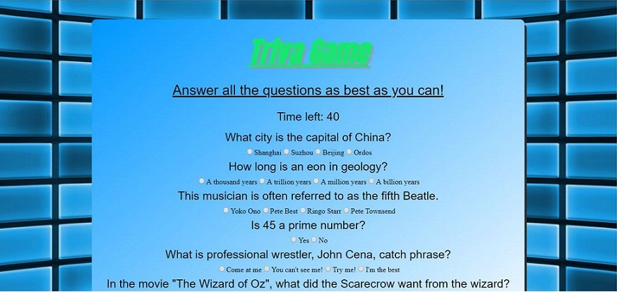

# trivia-game
Trivia game using JQuery, Javascript and timers.

## Game Flow

Once the START button is clicked, the timer will countdown. Answer the questions by selecting the radio buttons for each. Once the SUBMIT button or the time is up, your score will be tallied up. Click Restart to play again.

## Logic

The questions are gathered from an array of object. Each key in each object contains a question, an array of answers, and a rightAnswer value. 

When the start button in clicked, the list of questions and possible answers are loaded to the DOM. The question is written on 
 tag and answers to a radio button list. A countdown is also started with setIntreval, decrements by 1000 miliseconds.

Once the timer hits zero or the user hits the submit button, the game stops the intreval and runs the checkAnswers function. For each radio button selected, the function will run a check if the selected option value matches the value of rightAnswer for each object. The fuctions adds 1 to right if theres match, 1 to wrong if there is no match, and 1 to unanswered if no value is found.